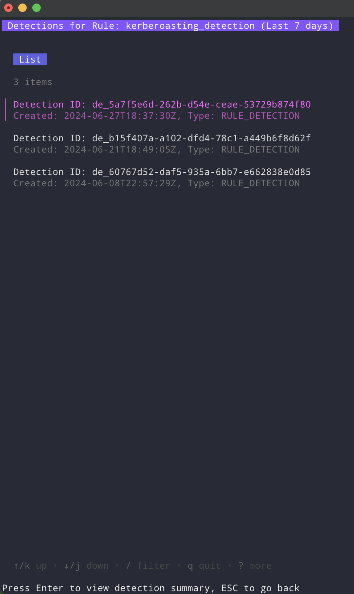

# goSecOps - Review detections & let LLM generate summaries

This tool is designed to fetch security rules and detections from Google SecOps, analyze the detections using an AI model (Claude), and provide a detailed summary of the findings. It also integrates with VirusTotal to check file hashes for malicious indicators.

## Why?

Because working in a terminal is faster and more efficient (for me at least).


## Features

- Fetch security rules from Google SecOps.
- Search and filter rules.
- Fetch detections for a selected rule.
- Generate AI-based summaries for detections.
- Integrate with VirusTotal to check file hashes.
- Display detailed summaries and highlights of detections.

## Installation

### Prerequisites

- Go 1.16 or later
- Google Chronicle (SecOps) credentials (service account JSON file)
- VirusTotal API key
- Claude API key

### Steps

1. **Clone the repository:**

    ```sh
    git clone https://github.com/the2dl/goSecops.git
    cd goSecops
    ```

2. **Set up environment variables:**

    Create a `.env` file in the project root and add the required environment variables:

    ```sh
    CHRONICLE_CRED_FILE=/path/to/your/chronicle/.creds
    CHRONICLE_PROJECT_ID=your-project-id
    CHRONICLE_INSTANCE_ID=your-instance-id
    CHRONICLE_REGION=us
    VIRUSTOTAL_API_KEY=your-virustotal-api-key
    CLAUDE_API_KEY=your-claude-api-key
    ```

    Sample `.env` file:
    ```sh
    CHRONICLE_CRED_FILE=/Users/dan/Documents/goSecops/.creds
    CHRONICLE_PROJECT_ID=12345678912345
    CHRONICLE_INSTANCE_ID=fc12345f-1234-3afe-ze34-f2b5dzb5ffr2
    CHRONICLE_REGION=us
    VIRUSTOTAL_API_KEY=8..f7215...e
    CLAUDE_API_KEY=sk-ant-..AA
    ```

4. **Set up `.creds` file:**

    Create a `.creds` file in the project root and add the required credentials; this is a service account JSON file from Google Cloud Console for Google SecOps:

    ```sh
    {
        "type": "service_account",
        "project_id": "your-project-id",
        "private_key_id": "your-private-key-id",
    ```

3. **Build the project:**

    ```sh
    go build -o goSecops main.go
    ```

4. **Run the tool:**

    ```sh
    ./goSecops
    ```

## Usage

- **Search Rules:** Use the search input to filter rules by name or ID.

- **View Detections:** Select a rule and press `Enter` to view detections for the last 7 days.

- **View Detection Summary:** Select a detection and press `Enter` to generate and view the AI-based summary.


- **Navigate:** Use `Tab` to switch focus between the search input and the list. Press `Esc` to go back or exit.

## License

This project is licensed under Unlicense.